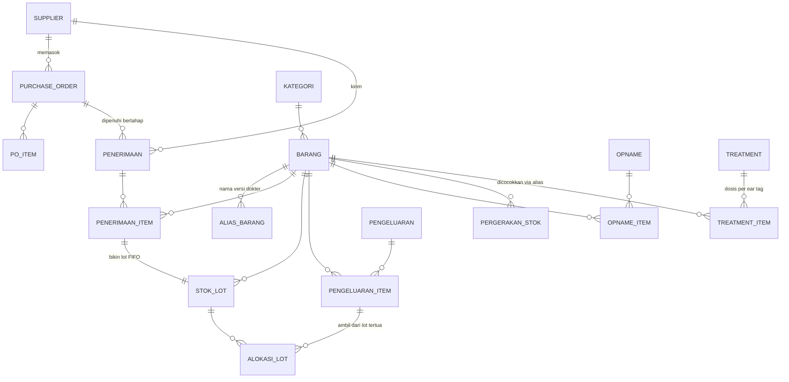

# Rancangan Database — Modul OVK & Perbekalan Kesehatan

Dokumen ini rancangan untuk dikoreksi, **belum jadi kode**. Fokusnya modul OVK
dulu, karena itu yang paling menderita di sistem sekarang.

Sistem lama: `PC_Kantor` (Streamlit + Google Sheets + GitHub Actions).
Sistem baru: Laravel + MySQL, di shared hosting cPanel tanpa akses SSH.

---

## 1. Keputusan yang sudah dikunci

| Hal | Keputusan | Alasan |
|---|---|---|
| Sumber data | MySQL jadi sumber kebenaran untuk OVK | Data ini aplikasi sendiri yang bikin, nggak ada divisi lain yang nulis |
| Metode harga | **FIFO** | Harga obat fluktuatif, perlu nilai persediaan yang akurat |
| Nota | **Header + detail** | Satu nota bisa banyak barang, harus bisa dibuka & dibatalkan utuh |
| Satuan | **Per barang, tanpa konversi global** | Isinya beda-beda: ml (10/50/100), tablet, pcs, box, liter |
| Barang keluar | Potong stok **saat diambil** | Simpel, dan mustahil kepotong dobel |
| Dosis dokter (ml) | Rekam medis + biaya per ekor, **tidak** motong stok | Menghindari potong stok dua kali |
| Batch & kadaluarsa | Belum sekarang | Tapi kolomnya disiapkan — FIFO sudah melacak per lot |
| PO | Bisa diterima bertahap | Kadang barang datang nggak sekaligus |

---

## 2. Prinsip utama: stok itu dihitung, bukan disimpan

Ini perubahan paling mendasar dari sistem sekarang.

**Sistem lama:** sheet `Stok Obat` punya kolom `Stok` berupa angka yang
di-*update* tiap ada transaksi. Kalau satu payload keproses dua kali, angkanya
ketambah dua kali — dan nggak ada cara tahu, apalagi balikin. Ini persis
penyebab bug "stok/opname ganda" yang ada di komentar `proses_ovk.yml`.

**Sistem baru:** ada tabel `pergerakan_stok` yang **cuma boleh ditambah, nggak
pernah di-update atau dihapus**. Stok = jumlahin pergerakan.

Konsekuensinya:

- Nota yang sama masuk dua kali → langsung ketahuan dan ditolak
- Salah input → dibalik pakai jurnal koreksi, bukan diedit diam-diam
- Riwayat utuh selamanya, dan siapa yang input tercatat
- Bug "stok ganda" jadi **mustahil secara struktur**, bukan sekadar ditambal

Kalau nanti butuh cepat, saldo boleh di-*cache* di tabel terpisah — tapi
kebenarannya tetap di kartu stok, dan cache selalu bisa dihitung ulang dari nol.

---

## 3. Peta tabel



Empat sumber (`penerimaan`, `pengeluaran`, `opname`, koreksi) semuanya nulis ke
`pergerakan_stok`. Keempat laporanmu — masuk, keluar, stok, hasil opname —
semuanya baca dari satu tempat itu.

---

## 4. Master

### `barang`
Namanya sengaja **bukan** `obat`, karena isinya campur: obat, alkes, bahan habis pakai.

| Kolom | Tipe | Catatan |
|---|---|---|
| `kode` | string, unik | Dibuat otomatis, bisa diubah manual |
| `nama` | string | |
| `kategori_id` | FK | Obat Cair, Tablet, Alkes, Bahan Habis Pakai, … |
| `satuan` | string | Satuan stok: `botol`, `tablet`, `pcs`, `box`, `liter` |
| `isi_nilai` | decimal, **nullable** | Isi per satuan, mis. botol berisi `100` |
| `isi_satuan` | string, **nullable** | Mis. `ml`. Cuma buat hitung biaya per ml |
| `stok_minimum` | decimal | Buat peringatan stok menipis |
| `aktif` | boolean | Barang lama disembunyikan, **bukan dihapus** |

`isi_nilai` & `isi_satuan` boleh kosong. Sarung tangan nggak butuh; Limoxin
(1 botol = 100 ml) butuh, supaya dosis 20 ml dokter bisa dihitung biayanya.

### `alias_barang`
Menggantikan `ALIAS_OBAT` yang sekarang di-*hardcode* 5 baris di `streamlit_app.py`.

| Kolom | Tipe | Catatan |
|---|---|---|
| `barang_id` | FK | |
| `alias` | string, unik | Teks apa adanya dari dokter: `vit b complex`, `Limoxin 200` |

Kalau ada nama yang nggak cocok saat impor, sistem **melaporkannya** biar kamu
petakan — nggak dibuang diam-diam seperti sekarang.

### `suppliers`
`kode`, `nama`, `kontak`, `telepon`, `alamat`, `aktif`

### `users` & peran
Ganti satu password global jadi user beneran. Peran awal:
`admin` · `gudang` · `dokter` · `viewer`.
Semua tabel transaksi bawa `dibuat_oleh` → akhirnya ketahuan siapa input apa.

---

## 5. Pembelian

### `purchase_orders`
`nomor` · `tanggal` · `supplier_id` · `status` · `catatan` · `dibuat_oleh`

Status: `draft` → `terbuka` → `sebagian` → `selesai` (atau `batal`).
Status `sebagian` itu yang menangani kasus barang datang bertahap.

### `purchase_order_items`
`purchase_order_id` · `barang_id` · `qty` · `harga_satuan` · `qty_diterima`

`qty_diterima` naik tiap ada penerimaan. Sisa PO = `qty - qty_diterima`.

### `penerimaan` (nota barang masuk)
`nomor` · `tanggal` · `supplier_id` · `purchase_order_id` *(nullable)* ·
`no_faktur_supplier` · `catatan` · `dibuat_oleh`

PO **boleh kosong** — barang masuk tanpa PO tetap bisa dicatat.

### `penerimaan_items`
`penerimaan_id` · `purchase_order_item_id` *(nullable)* · `barang_id` ·
`qty` · `harga_satuan` · `subtotal`

---

## 6. FIFO

### `stok_lot`
Tiap baris penerimaan bikin satu lot. Inilah yang bikin FIFO jalan.

| Kolom | Catatan |
|---|---|
| `barang_id` | |
| `penerimaan_item_id` | Asal-usulnya |
| `tanggal_masuk` | Urutan FIFO |
| `harga_satuan` | Harga beli lot ini |
| `qty_masuk` | Tetap, nggak berubah |
| `qty_sisa` | Berkurang saat dipakai |
| `tanggal_kadaluarsa` | **nullable — disiapkan buat nanti** |

### `alokasi_lot`
Nyatat satu pengeluaran ngambil dari lot mana aja. Ini yang bikin FIFO bisa
ditelusuri, bukan cuma hasil akhirnya.

`pengeluaran_item_id` · `stok_lot_id` · `qty` · `harga_satuan`

---

## 7. Pengeluaran

### `pengeluaran` (nota barang keluar)
`nomor` · `tanggal` · `tujuan` · `penerima` · `catatan` · `dibuat_oleh`

`tujuan`: `dokter` · `induksi` · `reweight` · `lainnya`
`penerima`: nama dokter/petugas yang ambil.

Ini pengganti kolom Keterangan teks bebas yang sekarang — jadi laporan bisa
dipecah per tujuan.

### `pengeluaran_items`
`pengeluaran_id` · `barang_id` · `qty` · `nilai_hpp`

`nilai_hpp` dihitung sistem dari FIFO, **bukan diketik**. Satu pengeluaran bisa
makan beberapa lot dengan harga beda — rinciannya di `alokasi_lot`.

---

## 8. Opname

### `opname`
`nomor` · `tanggal` · `periode_bulan` · `periode_tahun` · `status` · `dibuat_oleh`

Status `draft` → `final`. Selama draft boleh diubah; begitu final, dia nulis
selisihnya ke `pergerakan_stok` dan dikunci.

### `opname_items`
`opname_id` · `barang_id` · `stok_sistem` · `stok_fisik` · `selisih` ·
`nilai_selisih` · `keterangan`

`stok_sistem` dibekukan saat opname dibuat, biar selisihnya jujur.

---

## 9. Kartu stok — jantungnya

### `pergerakan_stok` — **append-only**

| Kolom | Catatan |
|---|---|
| `barang_id` | |
| `tanggal` | |
| `tipe` | `masuk` · `keluar` · `opname` · `koreksi` |
| `qty` | Bertanda: **+** masuk, **−** keluar |
| `harga_satuan` | |
| `nilai` | `qty × harga_satuan` |
| `stok_lot_id` | Lot mana (nullable buat koreksi) |
| `sumber_type` + `sumber_id` | Nunjuk balik ke nota asalnya |
| `keterangan` | |
| `dibuat_oleh` | |

Aturan main: **nggak ada `update`, nggak ada `delete`.** Salah input dibalik
pakai baris `koreksi` yang berlawanan.

---

## 10. Rekam medis (impor dari Google Sheets dokter)

Data ini **tidak** motong stok. Cuma buat rekam medis dan biaya per ekor.

### `treatment`
`shipment` · `ear_tag` · `tanggal` · `penanggung_jawab` · `pen_asal` ·
`diagnosa` · `berat_badan` · `kondisi` · `hash_baris`

`hash_baris` bikin impor aman diulang — baris yang sama nggak akan dobel.
Ini pengganti tambalan payload di workflow sekarang.

### `treatment_items`
`treatment_id` · `barang_id` *(nullable)* · `nama_obat_asli` · `kategori` ·
`dosis` · `satuan_dosis`

Sheet dokter itu format melebar (`Antibiotik 1`, `Dosis Antibiotik 1`,
`Antibiotik 2`, …). Saat impor dibalik jadi memanjang — logika yang sekarang
ada di `proses_multi_kolom_obat()`.

`barang_id` **boleh kosong**: kalau nama obat dokter belum ada aliasnya, barisnya
tetap disimpan dan ditandai perlu dipetakan. Nggak dibuang.

### `import_logs`
`sumber` · `mulai` · `selesai` · `jumlah_baris` · `jumlah_baru` · `status` · `pesan`

Jejak tiap impor dari Dropbox/Google Sheets. Pengganti notifikasi Telegram yang
sekarang cuma bilang "berhasil/gagal" tanpa detail.

---

## 11. Contoh alur — tolong dicek angkanya

Ini bagian paling penting buat dikoreksi. Kalau alurnya salah, tabelnya salah.

**1 Feb** — beli Limoxin-200 dari Supplier A, **10 botol @ Rp 85.000**

```
penerimaan #NM-2602-001
  └ item: Limoxin, qty 10, harga 85.000  → subtotal 850.000
       └ stok_lot #1  qty_masuk 10, qty_sisa 10, harga 85.000
            └ pergerakan_stok: +10 @ 85.000 = +850.000
```
Stok: **10 botol**, nilai **Rp 850.000**

**10 Feb** — beli lagi, **10 botol @ Rp 92.000** (harga naik)

```
       └ stok_lot #2  qty_masuk 10, qty_sisa 10, harga 92.000
            └ pergerakan_stok: +10 @ 92.000 = +920.000
```
Stok: **20 botol**, nilai **Rp 1.770.000**

**15 Feb** — drh. Gunawan ambil **12 botol**. FIFO ambil dari lot tertua dulu:

```
pengeluaran #NK-2602-014  tujuan: dokter, penerima: Gunawan
  └ item: Limoxin, qty 12
       ├ alokasi_lot: lot #1 → 10 botol @ 85.000 = 850.000   (lot #1 habis)
       └ alokasi_lot: lot #2 →  2 botol @ 92.000 = 184.000
       nilai_hpp = 1.034.000
            └ pergerakan_stok: −12, nilai −1.034.000
```
Stok: **8 botol** (semua lot #2), nilai **Rp 736.000**

**Sepanjang Feb** — dokter suntik ke sapi (impor dari sheet dokter):

```
treatment  ear_tag 4250, 27 Apr, Pincang
  └ treatment_item: Limoxin-200 LA, dosis 20 ml
```
Botol Limoxin isi 100 ml, harga rata pengambilan Rp 86.167/botol
→ biaya per ml ≈ Rp 862 → **biaya obat sapi 4250 ≈ Rp 17.233**

**Ini yang selama ini nggak bisa kamu lihat.** Dan stoknya nggak kepotong lagi
di sini — sudah kepotong pas dokter ambil.

**28 Feb** — opname, fisik ketemu **7 botol** (sistem bilang 8)

```
opname_item: stok_sistem 8, stok_fisik 7, selisih −1, nilai −92.000
     └ pergerakan_stok: −1 tipe opname
```
Stok akhir: **7 botol**, nilai **Rp 644.000**

---

## 12. Belum masuk rancangan ini

Sengaja ditahan dulu, bukan kelupaan:

- **Pakan** (Pemakaian, Master, Mutasi Sapi) — modul terpisah, sumbernya Dropbox
- **CPL** — datanya punya divisi Operasional, sifatnya impor satu arah
- **Populasi & sisa pakan** — nyangkut ke modul pakan
- **Grafik bahan baku** — read-only, paling gampang, ditaruh belakangan
- **Batch & kadaluarsa** — kolomnya sudah ada di `stok_lot`, tinggal dinyalakan

---

## 13. Yang perlu kamu koreksi

1. **Angka di bagian 11** — alurnya sudah sesuai kenyataan di lapangan?
2. **`tujuan` pengeluaran** — cukup `dokter`/`induksi`/`reweight`/`lainnya`,
   atau ada tujuan lain yang sering kepakai?
3. **Nomor nota** — mau format apa? (`NM-2602-001`) Atau ikut nomor faktur supplier?
4. **Opname** — sebulan sekali, atau bisa kapan saja?
5. **Siapa saja yang bakal pakai sistem ini**, dan boleh ngapain aja?
6. **Barang keluar buat induksi/reweight** — perlu nunjuk shipment/pen tertentu,
   atau cukup dicatat keluar aja?
